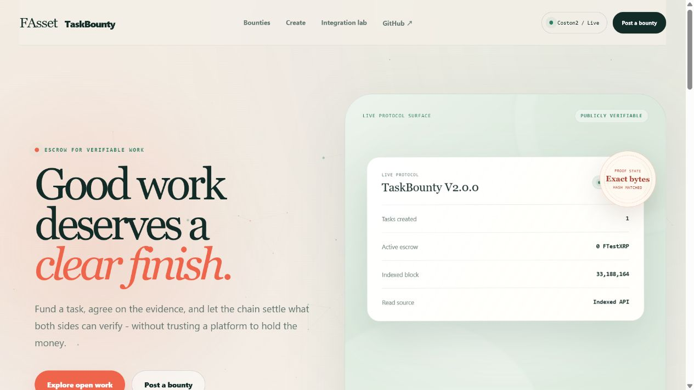
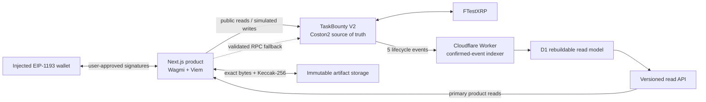

# FAsset TaskBounty

FAsset TaskBounty is a Coston2 product for the **Interoperable Asset Products**
track of the
[Flare Summer Signal](https://dorahacks.io/hackathon/flaresummersignal/detail)
hackathon on DoraHacks. It turns FTestXRP into a verifiable work reward through
smart-contract escrow, exact-byte artifact commitments, and a publicly
inspectable settlement trail.

The product lets a client escrow an FAsset such as test FXRP as the reward for
a task. A worker accepts the task, submits a committed off-chain result, and
receives the escrowed reward after the client verifies and approves the work.

## Public release

- Product: <https://fasset-taskbounty.pages.dev/>
- Read API: <https://fasset-taskbounty-api.zyf291436865.workers.dev>
- Coston2 V2 contract:
  [`0x2628...826F`](https://coston2-explorer.flare.network/address/0x26281308BE46D9b499579CC8776615C69f29826F)
- Copy-ready DoraHacks package:
  [`docs/submission/`](docs/submission/dorahacks-submission.md)
- Completed Coston2 evidence:
  [`docs/v2-completion-evidence.md`](docs/v2-completion-evidence.md)



## Why this is an interoperable asset product

FAssets bring assets from chains without native smart contracts, such as XRP,
into Flare's EVM environment. This project gives those assets a concrete use:
paying for global technical work through an on-chain escrow workflow.

## Current release

The current release implements and tests the token escrow state machine:

```text
Open -> InProgress -> Submitted -> Completed
  |
  +--------------------------------> Cancelled
```

The local tests use mock ERC-20 tokens, including an underfunding
fee-on-transfer case. TaskBounty V2 is now live on Coston2 and bound to the
official FTestXRP contract. V2 Task #1 completed the full two-account approve,
create, accept, immutable-result submission, creator verification, and reward
release workflow. Public RPC checks confirmed `Completed` status,
`totalEscrowed = 0`, and final balances of 8/0/2 FTestXRP for the creator, V2,
and worker. The historical V1 workflow remains available as separate evidence.

### Completed V2 Coston2 integration

- TaskBounty V2: [`0x26281308BE46D9b499579CC8776615C69f29826F`](https://coston2-explorer.flare.network/address/0x26281308BE46D9b499579CC8776615C69f29826F)
- Deployment transaction: [`0x9534f647676b0ff96e6a881f3a73ca5ee8de9c940fe26d8b18f9c280ff9a0ca8`](https://coston2-explorer.flare.network/tx/0x9534f647676b0ff96e6a881f3a73ca5ee8de9c940fe26d8b18f9c280ff9a0ca8)
- Contract version: `2.0.0`
- Reward token: `0x0b6A3645c240605887a5532109323A3E12273dc7` (FTestXRP)
- Network: Flare Testnet Coston2 (`114`)
- Runtime code: `4,777` bytes

### Completed V2 Task #1

- [V2 completion evidence](docs/v2-completion-evidence.md)
- [Machine-readable V2 completion record](docs/v2-completion-record.json)
- Task manifest hash: `0x346a8ed27a9ace38c3463718bf1043bd2d590a974a86c426fd8f0d245dda534b`
- Result manifest hash: `0x59f387788cb0121d7a9d6ba319e5580923037dfb3eb8e8e46e0c88cfa81177ce`
- Worker submission: [`0x3ed6d607294057f41cd05e4190e54174fbd6798b4c382c0ac5fc32f271f27124`](https://coston2-explorer.flare.network/tx/0x3ed6d607294057f41cd05e4190e54174fbd6798b4c382c0ac5fc32f271f27124)
- Creator approval and payment: [`0xaf9ed72d2b2d5cc9c0f2dec4a726bf7bce7435a8bb15245040e37e8d07814d2c`](https://coston2-explorer.flare.network/tx/0xaf9ed72d2b2d5cc9c0f2dec4a726bf7bce7435a8bb15245040e37e8d07814d2c)
- Final state: `Completed` (`3`)
- Final balances: Creator `8`, TaskBounty V2 `0`, Worker `2` FTestXRP
- Final liability: `totalEscrowed = 0`

### Historical V1 Coston2 integration deployment

- TaskBounty: [`0x6B98d7B6be4934c20bD8CdfdF2bc5Dfb3A454043`](https://coston2-explorer.flare.network/address/0x6B98d7B6be4934c20bD8CdfdF2bc5Dfb3A454043)
- Deployment transaction: [`0x8796ec11c3bbb6ba78fb072bf7ba12cdaa7927ec03574036229e3910cb5171b8`](https://coston2-explorer.flare.network/tx/0x8796ec11c3bbb6ba78fb072bf7ba12cdaa7927ec03574036229e3910cb5171b8)
- Reward token: `0x0b6A3645c240605887a5532109323A3E12273dc7` (FTestXRP)
- Network: Flare Testnet Coston2 (`114`)
- Build target: Solidity `0.8.35`, EVM `cancun`, optimizer enabled with 200 runs

This address runs the V1 ABI used to prove the first end-to-end workflow. It
remains valid historical evidence, but it does not contain the V2 content-hash
fields. Product transactions use the separate V2 deployment listed above.

### Completed Coston2 Task #1

- [Full escrow workflow evidence](docs/escrow-workflow-evidence.md)
- Worker submission: [`0xb9b590691e94f3f6b8367c39ff12707b6c2dfd8dc8bb93cce53bb4bde8aad993`](https://coston2-explorer.flare.network/tx/0xb9b590691e94f3f6b8367c39ff12707b6c2dfd8dc8bb93cce53bb4bde8aad993)
- Creator approval and payment: [`0x1f6d328ece3dfa179e8a0a513bb88a7f606c753e0531f4ecaa5047ece822c145`](https://coston2-explorer.flare.network/tx/0x1f6d328ece3dfa179e8a0a513bb88a7f606c753e0531f4ecaa5047ece822c145)
- Final state: `Completed` (`3`)
- Final balances: Creator `9`, TaskBounty `0`, Worker `1` FTestXRP

### V2 artifact-integrity model

V2 separates the task manifest, worker result, and post-approval completion
record. `createTask` and `submitWork` bind each URI to the Keccak-256 hash of
the exact artifact bytes:

```solidity
createTask(uint256 reward, string metadataURI, bytes32 metadataHash)
submitWork(uint256 taskId, string resultURI, bytes32 resultHash)
```

The contract also tracks `totalEscrowed` and rejects a deposit unless the
reward token delivers the exact requested amount. This prevents a
fee-on-transfer token from silently underfunding a task.

See [`docs/artifact-integrity.md`](docs/artifact-integrity.md) for the real-world
artifact workflow, sample manifests, Git Bash hashing command, URI choices,
completion-record model, and V1/V2 compatibility notes.
Runnable JSON starting points are in [`docs/examples/`](docs/examples/).
The generated post-approval record is in
[`docs/v2-completion-evidence.md`](docs/v2-completion-evidence.md).

### Product frontend and integration lab

**Live Coston2 dashboard:** <https://fasset-taskbounty.pages.dev/>

The `frontend/` application is a production-buildable Next.js static export
with a product surface and a deliberately separate QA surface:

- The production UI uses the Human Proof design system: a warm editorial
  surface, live protocol proof ticket, exact-byte evidence language, responsive
  layouts, and reduced-motion-safe ambient effects. Its migration and browser
  verification record is in
  [`docs/human-proof-migration-qa.md`](docs/human-proof-migration-qa.md).

- `/` explains the value proposition and reads live protocol totals.
- `/tasks/` discovers recent tasks from the current V2 deployment.
- `/tasks/view/?id=<id>` renders any existing task, verifies artifacts, derives
  the connected account's role from live task participants, and exposes only
  the lifecycle action that role and status allow.
- `/tasks/new/` builds a deterministic manifest, verifies the published exact
  bytes, prepares an exact reward-token allowance, and creates a funded task.
- `/lab/` preserves fixed Task #1 and Task #2 scenarios as regression fixtures;
  those IDs are no longer assumptions in the customer-facing product.

Viem performs public Coston2 reads and exact-byte Keccak-256 verification.
Wagmi discovers an injected EIP-1193 wallet and opens it only after the relevant
contract call has passed a public-RPC simulation and the user has explicitly
reviewed the intent. The generic lifecycle supports `acceptTask`, `submitWork`,
`approveTask`, and `cancelTask`; receipts are checked against the exact expected
contract event before the UI reports confirmation. Private keys, recovery
phrases, keystore files, and wallet passwords never enter the application.

The app is deployed on Cloudflare Pages with automatic builds from `main`; see
[`docs/frontend-hosting.md`](docs/frontend-hosting.md) and
[`frontend/README.md`](frontend/README.md) for the decision and Git Bash setup.
The product boundary and remaining beta limitations are documented in
[`docs/product-architecture.md`](docs/product-architecture.md). Historical
fixed-fixture write boundaries remain specified in
[`docs/frontend-approval-flow.md`](docs/frontend-approval-flow.md) and
[`docs/frontend-task-creation-flow.md`](docs/frontend-task-creation-flow.md).
The latest cross-layer quality audit, fixes, verification gates, and remaining
risks are recorded in
[`docs/current-stage-quality-review.md`](docs/current-stage-quality-review.md).

### Production read API and event indexer

**Live API:** <https://fasset-taskbounty-api.zyf291436865.workers.dev>

The `backend/` Cloudflare Worker indexes all five confirmed TaskBounty V2
lifecycle events into a versioned D1 schema. It keeps an idempotent checkpoint,
projects query-friendly task rows, verifies committed artifact bytes, and
serves health, protocol, cursor-paginated task-list, and task-detail endpoints.
The API has no chain-write or wallet-secret capability.

The frontend reads this API first after validating its deployment identity and
response shape. If the API is unavailable or invalid, it safely falls back to
the public Coston2 RPC, which remains the settlement source of truth. See
[`docs/read-layer-architecture.md`](docs/read-layer-architecture.md) for the
data model, trust boundary, public-RPC verification, Coston2 range constraint,
deployment commands, and release evidence.

The cross-layer production parity check is reproducible without a wallet:

```bash
cd /d/web3/web3-taskbounty/backend
npm run verify:production
```

## Repository layout

```text
web3-taskbounty/
├── contracts/            Solidity contracts, scripts, and Foundry tests
├── frontend/             Next.js static read and artifact-verification app
├── backend/              Event indexer and read API
├── docs/                 Product, evidence, architecture, and submission kit
└── README.md
```

## Architecture at a glance



The contract is the settlement authority. D1 is a disposable query projection,
not another ledger. Public reads work without a wallet; private keys and wallet
passwords never enter the application. See
[`docs/architecture.md`](docs/architecture.md) and
[`docs/read-layer-architecture.md`](docs/read-layer-architecture.md) for the
full trust model.

## Local setup

The project currently pins OpenZeppelin Contracts `v5.6.1` and forge-std
`v1.16.2`.

```bash
cd contracts
forge install foundry-rs/forge-std@v1.16.2 --no-git --shallow
forge install OpenZeppelin/openzeppelin-contracts@v5.6.1 --no-git --shallow
forge build
forge test
```

The current V2 suite contains 11 business tests, including 256 fuzz runs and a
fee-on-transfer underfunding test.

## Repeatable quality gates

```bash
# Run from Git Bash
cd /d/web3/web3-taskbounty
node scripts/check-markdown-links.mjs

cd contracts && forge fmt --check && forge test
cd ../frontend && npm ci && npm run check
npm audit --omit=dev --omit=optional
cd ../backend && npm ci && npm run check && npm audit --omit=dev
npm run verify:production
```

The same contract, frontend, backend, and documentation gates run on every push
and pull request through [GitHub Actions](.github/workflows/ci.yml). The CI
token has read-only repository contents permission; deployment remains a
separate, explicitly authorized operation.

The frontend is exported as static files with image optimization disabled, so
the deployed Pages artifact contains no Next.js server or Sharp runtime. The
non-optional production dependency audit is therefore the deployed boundary.
The full build-tree audit currently reports the upstream optional Sharp
advisory described in [`SECURITY.md`](SECURITY.md); it is monitored rather than
hidden or “fixed” with an unsupported forced downgrade.

## Coston2 setup

The repository contains the official Coston2 RPC alias and a dedicated
TaskBounty deployment script. See [`docs/coston2-setup.md`](docs/coston2-setup.md)
for the network, faucet, encrypted-keystore, balance-check, and deployment
steps.

## Safety boundary

- Development starts on Anvil and in Foundry tests.
- The public deployment uses Flare Testnet Coston2 only.
- No mainnet funds are required for the learning and submission workflow.
- This release has not received an independent smart-contract security audit
  and must not be represented as mainnet-ready.

## Submission status

The repository contains the required project description, target user, Flare
integration explanation, new-work evidence, deployed addresses, roadmap,
recording script, and final checklist in [`docs/submission/`](docs/submission/).
The only remaining organizer-facing actions are the user's video
recording/upload and authenticated DoraHacks form review/submission.
