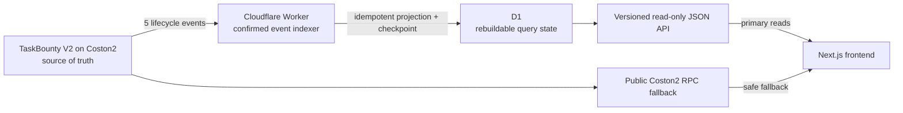

# TaskBounty read layer: indexer, D1, and API

## Release status

The production read layer is deployed on Cloudflare and contains no signing or
wallet-secret capability.

- API: <https://fasset-taskbounty-api.zyf291436865.workers.dev>
- Network: Flare Testnet Coston2 (`chainId 114`)
- TaskBounty V2: `0x26281308BE46D9b499579CC8776615C69f29826F`
- Deployment start block: `32928923`
- Worker version deployed on 2026-07-21:
  `e71a93c8-925e-4f0d-8f42-fa004142b4e1`
- Storage: Cloudflare D1, schema migration `0001_initial.sql`
- Schedule: one-minute Cloudflare Cron Trigger

## Why this layer exists

The contract is the settlement source of truth, but an EVM contract is not a
search engine. Calling `getTask(id)` is suitable for one known task; it is not
an efficient way to answer product queries such as “recent open tasks”, “tasks
created by this address”, or cursor-paginated history.

The read layer converts confirmed lifecycle logs into a query-oriented model:



D1 is not another authority. It stores a rebuildable projection and sync
checkpoint. If it is lost, the indexer can recreate it from the deployment
block. The frontend validates the API deployment identity and falls back to
direct public RPC when the API is unavailable or invalid.

## Indexed event model

The Worker handles all five V2 lifecycle events:

| Event | Projection effect |
|---|---|
| `TaskCreated` | Insert task and pending metadata integrity check |
| `TaskAccepted` | Assign worker and mark `In progress` |
| `WorkSubmitted` | Save result commitment and mark `Submitted` |
| `TaskCompleted` | Mark `Completed` |
| `TaskCancelled` | Mark `Cancelled` |

`indexed_events` uses `(chain_id, deployment_address, transaction_hash,
log_index)` as its primary key. Re-reading the same range therefore cannot
duplicate an event. Task projection writes and checkpoint advancement occur in
the same D1 batch for each range.

The indexer waits 12 blocks before treating data as confirmed. A D1 lease
prevents overlapping Cron invocations. Each invocation handles at most eight
ranges and eight events, keeping free-plan query and subrequest use bounded.
Health is `healthy` only when the protocol snapshot and durable checkpoint
both reach the current finalized target with zero lag.

## Coston2 RPC range constraint

The public Coston2 RPC currently rejects `eth_getLogs` ranges wider than 30
blocks. Replaying more than 160,000 historical blocks one 30-block request at a
time would exceed a Worker invocation's free-plan subrequest budget.

For ranges above 30 blocks the bootstrap process therefore uses the official
Coston2 explorer log endpoint as a discovery aid. It does **not** trust the
returned log bytes directly: every returned transaction is fetched from the
public RPC, and contract address, receipt block, log index, topics, and data
must match before ABI decoding. The response is bounded to 1 MiB, redirects are
rejected, and an event-dense range fails closed so it can be retried with a
smaller chunk.

This hybrid approach verifies every discovered event but cannot independently
prove that an explorer returned every event in an otherwise empty historical
range. Final protocol snapshots (`VERSION`, `nextTaskId`, `totalEscrowed`),
public-RPC parity checks, durable event counts, and the frontend RPC fallback
are the compensating controls. A future production-scale version should use an
archive RPC without the 30-block restriction or a second independent index
source.

## Artifact integrity

The Worker retrieves only:

- commit-pinned GitHub Raw URLs;
- `ipfs://` content through the configured IPFS gateway;
- `ar://` content through Arweave.

Downloads use manual, allowlisted redirects, a 15-second timeout, and a 1 MiB
streaming limit. The exact received bytes are hashed with Keccak-256 and
compared with the on-chain commitment. Title and description are exposed only
as display metadata; `verified` is the security-relevant result.

## API contract

| Endpoint | Result |
|---|---|
| `GET /v1/health` | initialization, checkpoint, finalized head, lag, errors |
| `GET /v1/protocol` | deployment identity and confirmed protocol snapshot |
| `GET /v1/tasks` | cursor pagination plus status/creator/worker filters |
| `GET /v1/tasks/:id` | task, artifacts, timeline, and normalized events |

Task IDs and token amounts are decimal strings so JavaScript never rounds EVM
integers. The frontend additionally rejects a mismatched chain ID, contract
address, contract version, malformed address/hash, unsafe block number, or
invalid decimal string.

CORS permits the production Pages origin and local development origins only.
The API supports `GET` and `OPTIONS`; it exposes no synchronization or write
endpoint.

## Reproducible Git Bash checks

```bash
cd /d/web3/web3-taskbounty/backend
npm ci
npm run check
npm run verify:production
npm run db:migrate:local
npm run dev:scheduled
```

In a second Git Bash window:

```bash
curl http://127.0.0.1:8787/__scheduled
curl http://127.0.0.1:8787/v1/health
curl http://127.0.0.1:8787/v1/protocol
curl "http://127.0.0.1:8787/v1/tasks?status=completed&limit=20"
curl http://127.0.0.1:8787/v1/tasks/1
```

Remote schema changes must be added as a new numbered migration and applied
before deploying the Worker:

```bash
npm run db:migrate:remote
npm run deploy
```

## 2026-07-21 release verification

- Backend: ESLint, TypeScript, 15 Vitest tests, and Wrangler dry-run build pass.
- Frontend: ESLint, TypeScript, 54 Vitest tests, and static production build
  pass.
- Contract: all 11 Foundry tests pass, including 256 fuzz runs.
- Dependency audit: backend and frontend production dependencies report zero
  known vulnerabilities from the official npm registry.
- Fresh local bootstrap completed in three bounded runs; the next three runs
  each recorded `events_seen=0`, `events_added=0`, while the durable total
  stayed at four events and one task.
- Fresh production bootstrap completed in three bounded Cron runs. Task #1 has
  four normalized events and both artifacts are hash-verified.
- Production API snapshot reproduced `VERSION=2.0.0`, `nextTaskId=2`,
  `totalEscrowed=0`, and Task #1 `Completed`, matching public RPC reads.
- Reproducible `npm run verify:production` compared the production API against
  public-RPC reads at the API's exact confirmed snapshot block and passed,
  including both artifact commitments.
- Production Pages deployment `d2bc82c1-1f73-4225-ad7c-93cb2f30bc09` serves
  <https://fasset-taskbounty.pages.dev/>. Browser checks of the task list and
  Task #1 detail reproduced the indexed API source, `Completed`, both verified
  artifacts, and zero console warnings or errors.
- A fresh local browser session was also tested with the local API online and
  then offline. The offline run switched to `Direct public-RPC fallback
  active`, reproduced Task #1, and emitted no console warnings or errors.
