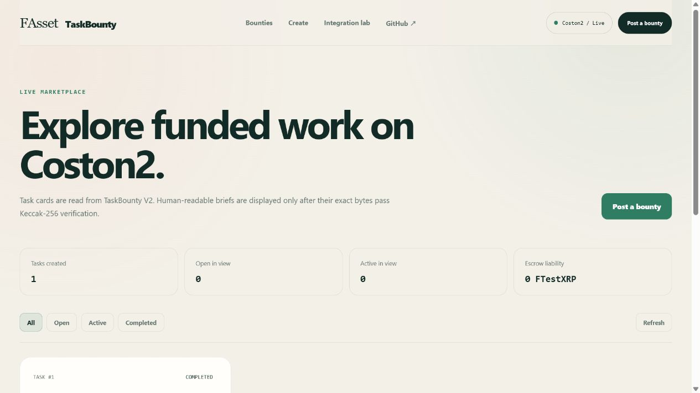
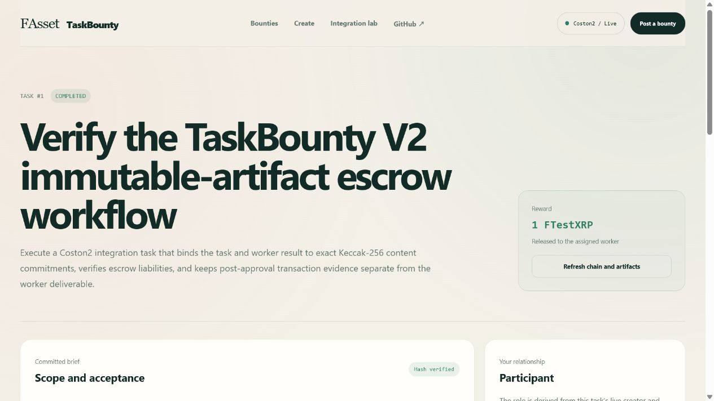
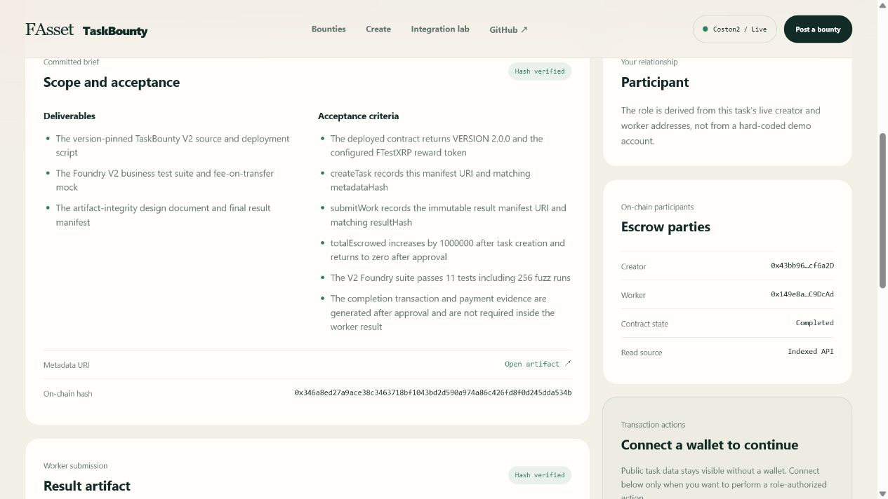

# DoraHacks submission copy: FAsset TaskBounty

Last verified: 2026-07-24
Target: [Flare Summer Signal](https://dorahacks.io/hackathon/flaresummersignal/detail) — Bounty 1, **Interoperable Asset Products**

This file is the copy-ready source for the final DoraHacks form. It avoids
claims that are not demonstrated by the repository, deployed Coston2 contract,
or public read API.

## Project name

**FAsset TaskBounty**

## One-line description

**Verifiable work escrow paid in FAssets on Flare.**

## Short description

FAsset TaskBounty lets a client fund technical work with FTestXRP on Flare,
bind the task brief and result to exact-byte Keccak-256 commitments, and release
the smart-contract escrow only after the creator verifies and approves the
work. A production frontend, read-only event indexer, and public evidence make
the full workflow inspectable without requiring a wallet for reads.

## Bounty

**Bounty 1 — Interoperable Asset Products**

FAssets make assets such as XRP programmable on Flare. TaskBounty gives an
FAsset a direct application-level use: paying a contributor for verifiable work
through an on-chain escrow state machine.

## Problem

XRP has deep liquidity and a global user base, but it cannot directly
participate in an EVM smart-contract workflow. Even after an interoperable
representation exists, users still need applications that turn the asset into
useful actions. Online work payments also have a trust problem: a client does
not want to pay before delivery, and a contributor does not want to deliver
without a funded reward.

## Solution

TaskBounty combines FTestXRP with a minimal, auditable escrow lifecycle:

1. A creator publishes a task manifest and escrows the exact reward.
2. A participant accepts the open task and becomes its assigned worker.
3. The worker publishes a result manifest whose exact bytes are committed
   on-chain.
4. The creator's browser verifies those bytes against the on-chain hash.
5. The creator approves the task, and the contract atomically marks it complete
   and transfers the FTestXRP reward to the worker.

An unaccepted task can be cancelled and refunded. The platform never receives
wallet secrets; the smart contract, rather than a platform account, holds the
temporary escrow.

## Target users

- XRP and FXRP holders who want to pay for technical or creative work;
- independent contributors who want proof that a reward is funded;
- open-source communities, DAOs, and small teams coordinating global work;
- operators who need a public, machine-verifiable record of task settlement.

## Live product and technical materials

- Live application: <https://fasset-taskbounty.pages.dev/>
- Source repository: <https://github.com/SharkHand3/fasset-taskbounty>
- Live read API: <https://fasset-taskbounty-api.zyf291436865.workers.dev>
- Contract architecture: [product architecture](../product-architecture.md)
- Read-layer architecture: [indexer, D1, and API](../read-layer-architecture.md)
- Completed workflow evidence: [V2 Coston2 record](../v2-completion-evidence.md)
- Machine-readable settlement evidence:
  [completion record](../v2-completion-record.json)

## Product screenshots

### Live protocol and product positioning

### Coston2 marketplace

### Completed escrow

### Exact-byte artifact verification

## How it uses Flare

- **Network:** Flare Testnet Coston2, chain ID `114`.
- **FAsset:** the official Coston2 FTestXRP contract at
  `0x0b6A3645c240605887a5532109323A3E12273dc7` is the escrow and settlement
  token.
- **Settlement:** TaskBounty V2 runs as an EVM contract on Coston2 and enforces
  permissions, lifecycle transitions, exact escrow accounting, cancellation,
  and reward release.
- **Wallet integration:** Wagmi and Viem connect an injected EIP-1193 wallet,
  simulate every write against current Coston2 state, and verify the expected
  event in a successful receipt before reporting completion.
- **Public verification:** direct Coston2 RPC reads remain the settlement source
  of truth. A Cloudflare Worker indexes confirmed contract events into D1 for
  product queries, while the frontend falls back to public RPC if the API is
  unavailable or returns a mismatched deployment identity.

TaskBounty composes the FTestXRP token produced by the FAssets system; it does
not reimplement FAsset minting and does not claim a direct FDC integration.
This boundary keeps the project focused on product utility for the asset.

## What was built during the program

Before the program target was selected, the repository contained a Foundry
learning scaffold and an incomplete TaskBounty data model with no executable
escrow workflow.

During the program, the project added:

- a hardened Solidity escrow state machine with role checks, custom errors,
  reentrancy protection, exact ERC-20 receipt accounting, liabilities, and five
  lifecycle events;
- Foundry unit, negative-path, and fuzz tests, including rejection of
  fee-on-transfer underfunding;
- a Coston2 deployment bound to FTestXRP and a completed two-account lifecycle;
- immutable task/result manifests and exact-byte Keccak-256 verification;
- a responsive Next.js/TypeScript product UI with public reads, task discovery,
  role-aware writes, simulation gates, receipt verification, and wallet-secret
  isolation;
- a Cloudflare Worker + D1 read layer with confirmed-event indexing,
  idempotent checkpoints, artifact verification, pagination/filtering, and
  direct-RPC fallback;
- repeatable cross-layer tests, production parity checks, architecture records,
  and public explorer evidence.

The detailed before/after evidence is in
[new-work-evidence.md](new-work-evidence.md).

## Smart contracts and deployments

| Item | Address or transaction | Evidence |
|---|---|---|
| TaskBounty V2 | `0x26281308BE46D9b499579CC8776615C69f29826F` | [Coston2 explorer](https://coston2-explorer.flare.network/address/0x26281308BE46D9b499579CC8776615C69f29826F) |
| FTestXRP | `0x0b6A3645c240605887a5532109323A3E12273dc7` | [Flare Developer Hub](https://dev.flare.network/fxrp/token-interactions/fxrp-address) |
| V2 deployment | `0x9534f647676b0ff96e6a881f3a73ca5ee8de9c940fe26d8b18f9c280ff9a0ca8` | [Coston2 explorer](https://coston2-explorer.flare.network/tx/0x9534f647676b0ff96e6a881f3a73ca5ee8de9c940fe26d8b18f9c280ff9a0ca8) |
| Worker submission | `0x3ed6d607294057f41cd05e4190e54174fbd6798b4c382c0ac5fc32f271f27124` | [Coston2 explorer](https://coston2-explorer.flare.network/tx/0x3ed6d607294057f41cd05e4190e54174fbd6798b4c382c0ac5fc32f271f27124) |
| Creator approval / payment | `0xaf9ed72d2b2d5cc9c0f2dec4a726bf7bce7435a8bb15245040e37e8d07814d2c` | [Coston2 explorer](https://coston2-explorer.flare.network/tx/0xaf9ed72d2b2d5cc9c0f2dec4a726bf7bce7435a8bb15245040e37e8d07814d2c) |

At the recorded settlement block, Task #1 was `Completed`, the worker had
received `1 FTestXRP`, the contract token balance was zero, and
`totalEscrowed` was zero. The creator and worker were two distinct testnet
accounts.

## Technical stack

- Solidity 0.8.35, OpenZeppelin Contracts, Foundry
- Next.js 16, React 19, TypeScript 5, Wagmi, Viem, TanStack Query
- Cloudflare Pages, Workers, Cron Triggers, and D1
- Flare Coston2 public RPC and explorer
- Keccak-256 exact-byte commitments with pinned GitHub Raw, IPFS, and Arweave
  retrieval policies

## Technical choices and trust model

- The Coston2 contract is the settlement authority.
- D1 is a disposable, rebuildable read projection, not a second ledger.
- Reads work without a wallet; only explicit state changes open the wallet.
- Every write is simulated before signature, but the wallet remains the final
  signing boundary.
- Artifact data is useful only after its retrieved bytes match the on-chain
  commitment.
- The platform is not a custodian: it cannot sign, transfer, or recover user
  funds. The escrow contract temporarily holds the creator's reward according
  to its code.

## Current validation

- Contract, frontend, and backend quality gates pass locally.
- The production API is compared against the public RPC at the same confirmed
  snapshot block by `backend/scripts/verify-production.mjs`.
- The live frontend reads the indexed API, validates deployment identity, and
  has a direct-RPC fallback.
- The repository contains explorer receipts, exact artifact hashes, immutable
  URIs, historical balance checks, and a machine-readable completion record.

This is testnet software. It has not undergone an independent smart-contract
audit, has no production users or partner commitments, and must not be
described as mainnet-ready.

## Short roadmap

1. **Usability:** managed immutable artifact publishing to IPFS/Arweave, clearer
   upload status, and notification support.
2. **Marketplace:** search, reputation, creator/worker profiles, and product
   analytics while preserving direct on-chain verification.
3. **Settlement:** user-researched milestone, timeout, and dispute mechanisms
   rather than adding governance complexity before the rules are understood.
4. **Flare expansion:** evaluate Flare Smart Accounts or gas abstraction and
   XRPL-to-Flare onboarding flows after the testnet UX is validated.
5. **Production readiness:** independent security review, monitored archive-RPC
   indexing, and Songbird/mainnet deployment only after risk controls pass.

## Demo video

Use the recording plan and English narration in
[demo-script.md](demo-script.md). Replace this paragraph in the DoraHacks form
with the final public video URL after recording and uploading it.
